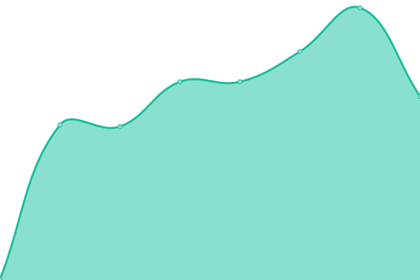
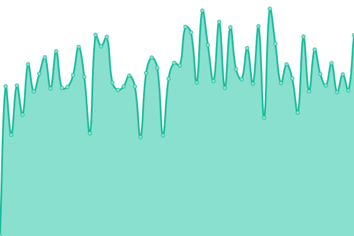

# [📈 Live Status](https://status.mochimo.org): <!--live status--> **🟨 Degraded performance**

This repository contains the open-source uptime monitor and status page for [adequatesystems](https://status.mochimo.org), powered by [Upptime](https://github.com/upptime/upptime).

With [Upptime](https://upptime.js.org), you can get your own unlimited and free uptime monitor and status page, powered entirely by a GitHub repository. We use [Issues](https://github.com/adequatesystems/status-mochimo-org/issues) as incident reports, [Actions](https://github.com/adequatesystems/status-mochimo-org/actions) as uptime monitors, and [Pages](https://status.mochimo.org) for the status page.

<!--start: status pages-->
<!-- This summary is generated by Upptime (https://github.com/upptime/upptime) -->
<!-- Do not edit this manually, your changes will be overwritten -->
<!-- prettier-ignore -->
| URL | Status | History | Response Time | Uptime |
| --- | ------ | ------- | ------------- | ------ |
|  [Mochimo Website](https://mochimo.org) | 🟩 Up | [mochimo-website.yml](https://github.com/adequatesystems/status-mochimo-org/commits/HEAD/history/mochimo-website.yml) | 

 270ms
     
 | 

<a href="https://status.mochimo.org/history/mochimo-website">100.00%</a>
    

|  [Official Mochimo API](https://api.mochimo.org/network/status) | 🟩 Up | [official-mochimo-api.yml](https://github.com/adequatesystems/status-mochimo-org/commits/HEAD/history/official-mochimo-api.yml) | 

 552ms
     
 | 

<a href="https://status.mochimo.org/history/official-mochimo-api">99.57%</a>
    

|  [Direct Mochimo API in Germany](https://api-deu.mochimo.org/network/status) | 🟩 Up | [direct-mochimo-api-in-germany.yml](https://github.com/adequatesystems/status-mochimo-org/commits/HEAD/history/direct-mochimo-api-in-germany.yml) | 

 0ms
     
 | 

<a href="https://status.mochimo.org/history/direct-mochimo-api-in-germany">99.57%</a>
    

|  [Direct Mochimo API in Singapore](https://api-sgp.mochimo.org/network/status) | 🟩 Up | [direct-mochimo-api-in-singapore.yml](https://github.com/adequatesystems/status-mochimo-org/commits/HEAD/history/direct-mochimo-api-in-singapore.yml) | 

 0ms
     
 | 

<a href="https://status.mochimo.org/history/direct-mochimo-api-in-singapore">99.83%</a>
    

|  [Direct Mochimo API in United States](https://api-usc.mochimo.org/network/status) | 🟩 Up | [direct-mochimo-api-in-united-states.yml](https://github.com/adequatesystems/status-mochimo-org/commits/HEAD/history/direct-mochimo-api-in-united-states.yml) | 

 0ms
     
 | 

<a href="https://status.mochimo.org/history/direct-mochimo-api-in-united-states">100.00%</a>
    

|  [Development Mochimo API](https://dev-api.mochimo.org:8443/network/status) | 🟨 Degraded | [development-mochimo-api.yml](https://github.com/adequatesystems/status-mochimo-org/commits/HEAD/history/development-mochimo-api.yml) | 

 0ms
     
 | 

<a href="https://status.mochimo.org/history/development-mochimo-api">0.00%</a>
    

|  [Direct Mochimo Core Node in Germany](core-deu.mochimo.org) | 🟩 Up | [direct-mochimo-core-node-in-germany.yml](https://github.com/adequatesystems/status-mochimo-org/commits/HEAD/history/direct-mochimo-core-node-in-germany.yml) | 

 0ms
     
 | 

<a href="https://status.mochimo.org/history/direct-mochimo-core-node-in-germany">99.76%</a>
    

|  [Direct Mochimo Core Node in Singapore](core-sgp.mochimo.org) | 🟩 Up | [direct-mochimo-core-node-in-singapore.yml](https://github.com/adequatesystems/status-mochimo-org/commits/HEAD/history/direct-mochimo-core-node-in-singapore.yml) | 

 0ms
     
 | 

<a href="https://status.mochimo.org/history/direct-mochimo-core-node-in-singapore">99.84%</a>
    

|  [Direct Mochimo Core Node in United States](core-usc.mochimo.org) | 🟩 Up | [direct-mochimo-core-node-in-united-states.yml](https://github.com/adequatesystems/status-mochimo-org/commits/HEAD/history/direct-mochimo-core-node-in-united-states.yml) | 

 0ms
     
 | 

<a href="https://status.mochimo.org/history/direct-mochimo-core-node-in-united-states">100.00%</a>
    

<!--end: status pages-->

[**Visit our status website →**](https://status.mochimo.org)

## 📄 License

- Powered by: [Upptime](https://github.com/upptime/upptime)
- Code: [MIT](./LICENSE) © [Anand Chowdhary](https://anandchowdhary.com), supported by [Pabio](https://pabio.com)
- Data in the `./history` directory: [Open Database License](https://opendatacommons.org/licenses/odbl/1-0/)
